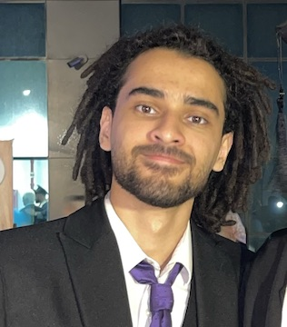

# About Me

I am Abdelrahman Mohamed, a recent Computer Science graduate. Welcome to my portfolio!

## Education

Bachelor of Science (Honours) in Computer Science.  
APU-DMU DUAL DEGREE  
Asia Pacific University (APU), Malaysia and De Montfort University (DMU), UK.

## Skills

- Programming Languages: C++, Java, Python
- Web Development: HTML, CSS, JavaScript
- Cloud: AWS, Docker

## Hobbies

- Tech Enthusiast
- Team Collaboration
- Exploring New Technologies

